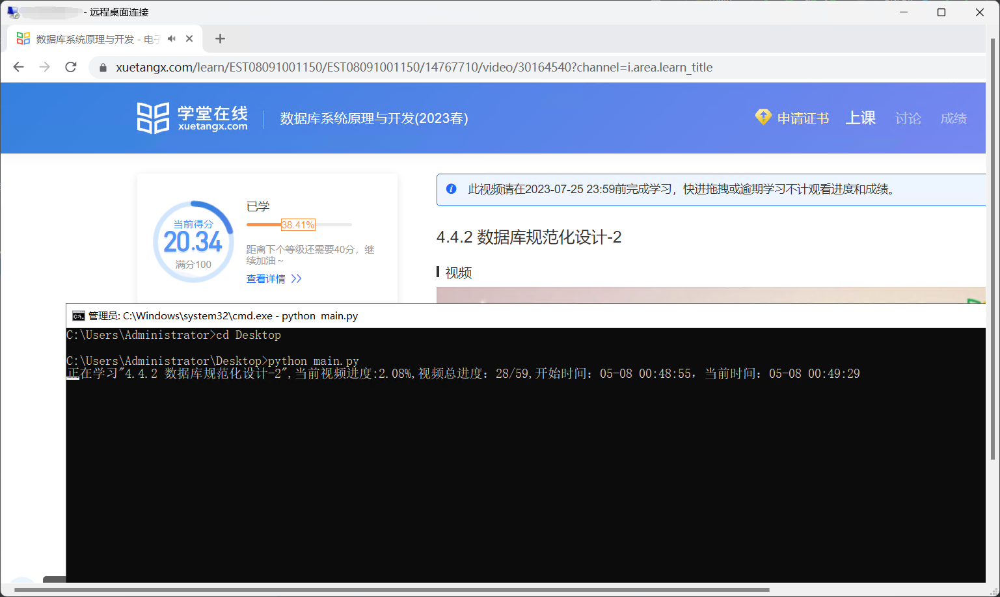

脚本写的比较仓促，有问题重新运行即可

部署过程参考https://github.com/D4wnnn/uestc_dxpx_auto_play

运行时需要随便打开一个播放着的视频，然后脚本会自动读取目录，按理来说脚本的通用性比较大，可以满足学堂在线的任何视频课程。

## 效果

(可把cmd框拉长一点，否则日志打印会比较乱)

我的博客：https://blog.acdawn.cn

如遇问题可加qq2638177031