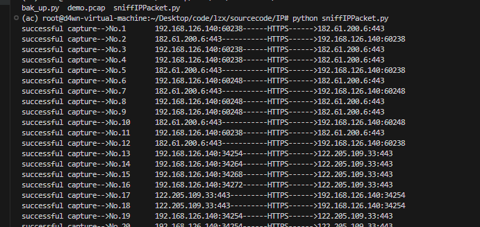
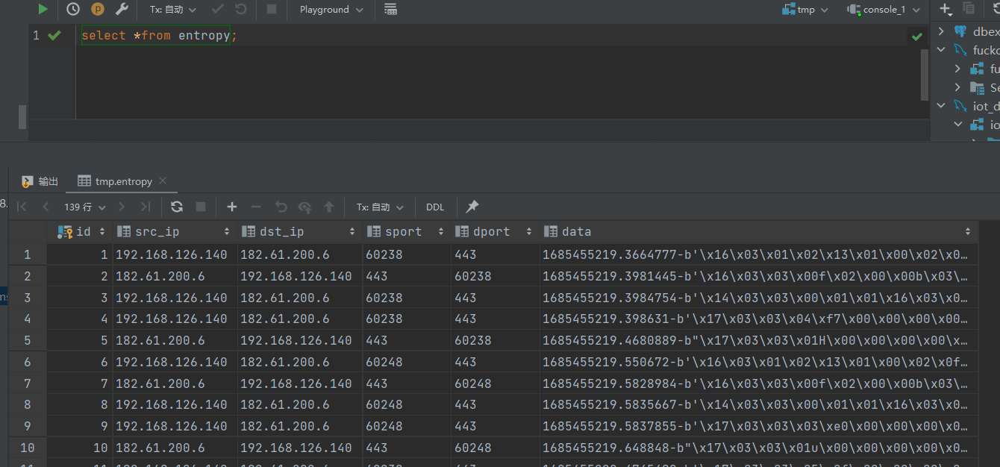
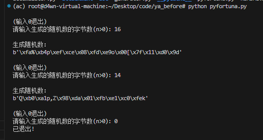
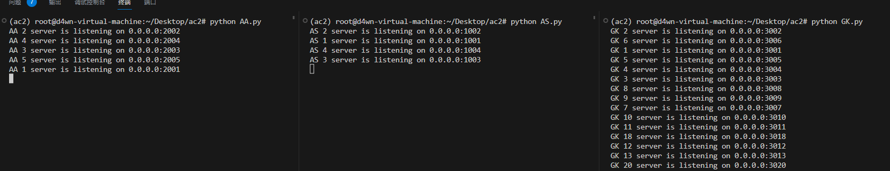
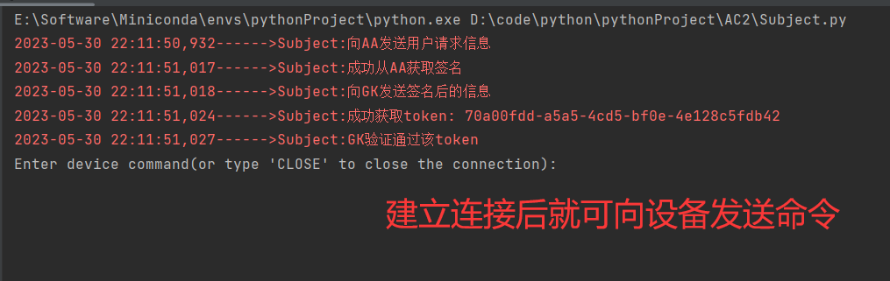
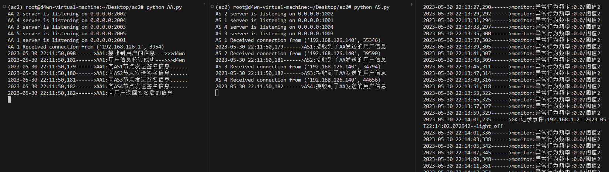

# 一些说明

分为三个文件夹：

* randomNumGeneration
* sniffIPPacket
* Demo

## sniffIPPacket

对应`lzx`分支下的`sourcecode/IP`文件夹，修改内容如下:

1. 原来的代码没办法做到边抓包边存储，只能等到下一次运行程序的时候才能分析上一次抓到的流量
2. 过滤掉了SSH协议还有MYSQL存储数据时候的流量包(如果不过滤会每时每刻都抓到包)
3. 另外也加了点实时抓包产生的日志

## randomNumGeneration

对应`ya_before`分支，修改内容如下:

1. generator.py里面的AES CTR加密用到的计数器Counter没办法实现手动+1和打印值，就手动写了一个CustomCounter类,在原有的Crypto模块的Counter类基础上增加了功能
2. accumulator.py里面在实现论文中“在生成器第n次重播种时，如果n是2k的整数倍，子池k将被调用”功能的时候，我发现池子并没有更新成功，就手动改了下
3. pyfortuna.py里面的在输出的时候有一些格式问题，我改了下

现在能够实现连续的产生随机值，有一些很深入的地方还没有改动,但是起码可以能连续的运行了(有点逻辑问题)

## Demo

这个是简单实现的有AA，AS，GK等元素的demo，暂未加入区块链

server文件夹是运行在服务器端的

client文件夹是运行在客户端的

运行服务端的`AA`,`AS`,`GK`：

运行客户端的`Subject`：

服务端日志：

